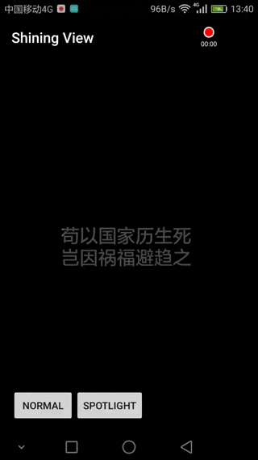

##反光效果

##聚光灯效果

##获得
* maven

```
 <dependency>
  <groupId>cn.liuyi999111</groupId>
  <artifactId>shining-view</artifactId>
  <version>0.0.1</version>
  <type>pom</type>
</dependency>
```
* gradle

```
compile 'cn.liuyi999111:shining-view:0.0.1'
```